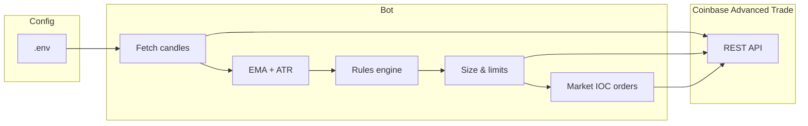

# Coinbase Advanced Trade — Systematic EMA Bot

**Repository (clone / issues / PRs):** [github.com/endless-sky-team/coinbase-trading-bot](https://github.com/endless-sky-team/coinbase-trading-bot)

**Keywords:** coinbase coinbase-api coinbase-bot advanced-trade cdp-api trading-bot ema-crossover atr trend-filter paper-trading market-ioc typescript btc eth sol crypto algorithmic-trading automated-trading automated-crypto quant fintech risk-sizing zod nodejs open-source institutional retail spot hft retail-pro api-keys portfolio tracker usd coinbase-pro legacy-hmac cdp-keys rest-client fill-or-kill ioc market-order cloud-api developer-platform

**Related:** [binance-trading-bot](https://github.com/endless-sky-team/binance-trading-bot) · [bybit-trading-bot](https://github.com/AI4FinanceFoundation/bybit-trading-bot) · [ai-trading-agent](https://github.com/endless-sky-team/ai-trading-agent)

**Jump to:** [At a glance](#at-a-glance) · [Your journey](#your-journey-in-four-beats) · [Who this is for](#who-this-is-for) · [Quick start](#quick-start-first-time-users) · [npm scripts & dependencies](#npm-scripts--dependencies) · [Configuration](#configuration-reference) · [Coinbase API notes](#coinbase-api-notes) · [Project layout](#project-layout) · [Go live](#enabling-live-trading-read-carefully) · [Troubleshooting](#troubleshooting) · [Related projects (same workspace)](#related-projects-same-workspace) · [Your next move](#your-next-move-invitation)

---

## Related projects (same workspace)

| Project | Venue | Focus |
|---------|--------|--------|
| [Binance Spot bot](https://github.com/endless-sky-team/binance-trading-bot) | Binance Spot (CCXT) | SuperTrend / EMA+RSI, long-only spot |
| [Bybit trend bot](https://github.com/AI4FinanceFoundation/bybit-trading-bot) | Bybit V5 linear USDT perps | EMA + ADX + ATR, SL/TP via trading-stop |
| [AI trading agent](https://github.com/endless-sky-team/ai-trading-agent) | Lighter + OpenRouter | LLM tool-calling, PostgreSQL audit trail |

---

## The pitch — why people stick around

**Most trading tools ask you to trust a logo. This one asks you to read the code.**

- **Clarity you can build on** — One loop, one strategy module, and configuration that is **validated at startup** (so bad env vars fail fast, not in production).
- **Discipline, baked in** — **Paper trading is the default.** You opt in to live orders with a single flag—on purpose.
- **Risk you define** — Size entries with a **per-trade risk fraction** and an optional **hard cap** per order in your quote currency. The bot does not “guess” your tolerance.
- **A strategy people actually recognize** — **EMA cross + long-term EMA filter** and **ATR** logging mirror ideas you will find in books, courses, and prop-style playbooks: trend follow when the market agrees, step aside when the cross says to exit.
- **Serious stack** — [TypeScript 5](https://www.typescriptlang.org/), **Node 20+**, and [coinbase-advanced-node](https://www.npmjs.com/package/coinbase-advanced-node) talking to the real Advanced Trade API—the same class of building blocks used by developers who treat execution as software engineering.

**Ideal if you** want to **automate a rule you understand**, **learn systematic trading on real infrastructure**, or **ship a v1** you can later upgrade with your own risk engine—without starting from a fragile script you found in a forum thread.

---

## At a glance

| You want to… | What this gives you |
|--------------|---------------------|
| **Get going in one session** | `npm install` → copy `.env` → `npm run dev` and you are pulling candles. |
| **See signals before you risk capital** | **Paper mode on by default** — logs what would have traded. |
| **Own your stack** | Full source: indicators, strategy, execution—fork it, don’t rent it. |
| **Stay in control** | Tweak EMAs, pair, and poll interval in `.env` without touching the exchange UI every hour. |
| **Grow from prototype to system** | Clean folders so you can add stops, websockets, or a second strategy without a rewrite. |

**Under the hood (one sentence):** a production-style client that runs a **trend-following** EMA rule, applies **position sizing** from *your* settings, and only sends live **market** orders when you say so.

---

## Your journey in four beats

1. **Connect in minutes** — Add keys to `.env`, run `npm run dev`, and you are already streaming **real** market structure into your terminal—not a demo with fake prices.
2. **Watch the rules work in plain sight** — Every cycle logs **close, EMAs, ATR, signal, balances**. The story is in the data, not in someone else’s “AI.”
3. **Tune like a product** — Swap pair, timeframes, and EMAs from configuration; iterate without rebuilding your *idea* from scratch every week.
4. **Promote to live on your terms** — **Paper is default** for a reason. When the logs still make sense to you, **you** flip one flag. That’s the bar.

**That’s the hook:** not “magic money,” but **a machine you understand** that can keep watching when you need to work, sleep, or think.

---

## Who this is for

| You are… | You’ll care because… |
|----------|----------------------|
| **A developer** | You want **Git, TypeScript, and a real REST client** next to your trading idea—not a binary blob called “strategies.dll.” |
| **A self-directed trader** | You want a **documented rule** and **reproducible logs** you can review when emotions have cooled. |
| **A learner** | You want the **full path**: candles → math → *intent* → (optional) order—on the **same** exchange serious traders use. |
| **A builder / side-project founder** | You need a **credible v1** you can show: “this places orders through Coinbase; here’s the repo.” |
| **Anyone burned by “bots” in a box** | **You** hold the code. If something is wrong, you can **find the line**—not file a support ticket and hope. |

---

## We’re straight with you (this builds trust, not hype)

- We do **not** claim guaranteed **profits**, “passive income,” or a secret edge. **Markets change; rules break; capital is at risk.**
- We **do** offer **full transparency**, **paper-by-default** execution, and a **serious** starting point to learn and extend—*if* you put in the work on testing and risk.
- The goal isn’t a lottery ticket. It’s **ownership of your process** in a form you can run, measure, and improve.

---

## Why this project exists (technical promise)

| Goal | How this project helps |
|------|-------------------------|
| **Clarity** | One strategy, one loop, explicit env-driven configuration (validated with [Zod](https://zod.dev/)). |
| **Safety** | **Paper trading is the default**; real orders require you to opt in explicitly. |
| **Control** | Risk per trade and optional per-order caps are separate from the signal logic. |
| **Maintenance** | Typed code, [coinbase-advanced-node](https://www.npmjs.com/package/coinbase-advanced-node) for the exchange API, Node 20+. |

> **Important:** Marketing copy does not change market reality. **Trading involves risk of loss. Past results do not predict future results.** This repository is **not** financial, tax, or legal advice. You are responsible for API keys, permissions, product choice, fees, and compliance with law and Coinbase terms. **Nothing here promises profit.**

---

## What the strategy does (in plain language)

The bot uses a **double EMA crossover** on candle closes, with a **long-term EMA** as a **trend filter**—a combination widely used in systematic trading and taught in many technical and quantitative finance resources.

- **Entry (buy signal):** Shorter EMA crosses **above** longer EMA **and** price is on the “right side” of the trend EMA (configurable, default: above the 200-period EMA on your chosen candle size).
- **Exit (sell signal):** Shorter EMA crosses **below** longer EMA (full base exit, subject to min order sizes).

**ATR (Average True Range)** is calculated for each cycle and logged so you can extend the bot (e.g. dynamic stops, volatility-scaled size) without reverse-engineering the code.

This is **not** a guarantee of positive returns. **Edge** in live markets depends on product, timeframe, costs, slippage, and regime—and must be **measured** (backtest, walk-forward, paper trade) for *your* market and *your* parameters.

---

## High-level flow



---

## Requirements

- **Node.js 20+**
- A **Coinbase** account with [Advanced Trade](https://www.coinbase.com/advanced-trade) access
- An **API key** with appropriate permissions (read balances, read market data, **trade** only if you disable paper mode)

---

## npm scripts & dependencies

From `package.json` (**package:** `coinbase-adv-trade-bot`):

| Script | Command | Purpose |
|--------|---------|---------|
| `npm run dev` | `node --import tsx src/index.ts` | Run TypeScript without a separate compile step. |
| `npm run build` | `tsc` | Emit JavaScript to `dist/` (`npm start` expects `dist/index.js`). |
| `npm start` | `node dist/index.js` | Production-style run **after** `npm run build`. |
| `npm run typecheck` | `tsc --noEmit` | CI / local compile validation only. |

Main runtime dependencies:

| Dependency | Role |
|------------|------|
| [coinbase-advanced-node](https://www.npmjs.com/package/coinbase-advanced-node) | Typed client for Coinbase Advanced Trade REST endpoints. |
| [zod](https://zod.dev/) | Validates `.env` once at startup. |
| [dotenv](https://www.npmjs.com/package/dotenv) | Loads `.env` locally. |

---

## Coinbase API notes

- **Products:** `PRODUCT_ID` must be a live Advanced Trade **product ID** (e.g. `BTC-USD`). The bot validates format at startup—typos fail fast rather than silently polling the wrong instrument.
- **Candles:** The loop requests historical candles until the strategy has enough bars for `EMA_TREND` **and** the crossover logic; coarse granularities (`ONE_DAY`) mean slower “strategy-ready” startup than `ONE_MINUTE`/`FIVE_MINUTE`.
- **Orders:** Entries use **market IOC** with **`quote_size`**; sizing merges **`RISK_PER_TRADE`** with optional **`MAX_QUOTE_PER_ORDER`**. Coinbase minimum increments (`quote_min_size`, `base_min_size`) still apply—the README troubleshooting lists rejects tied to minima.
- **Rate limits:** Advanced Trade applies REST rate limits per key and endpoint class. For a single pair and **one poll every `POLL_MS`**, traffic is modest; if you shorten `POLL_MS` aggressively or run many forks of this bot on the **same** key, watch for `429`-style throttling in logs and back off.
- **Not modeled here:** Full order book, historical fill reconstruction, or sub-account routing—extend the client layer if you need them.

---

## Quick start (first-time users)

### 1. Install

```bash
git clone https://github.com/endless-sky-team/coinbase-trading-bot.git
cd "coinbase trading bot"
npm install
```

### 2. Configure environment

```bash
copy .env.example .env
```

On macOS or Linux:

```bash
cp .env.example .env
```

Edit `.env` and add credentials (see [Authentication](#authentication) below). **Leave `PAPER_TRADING=1` until you are ready.**

### 3. Build and run

```bash
npm run build
npm start
```

**Development (TypeScript without a separate build):**

```bash
npm run dev
```

You should see timestamped log lines: closes, EMAs, ATR, signal, and balances. In paper mode, **no orders** are sent.

### That “it’s alive” moment

The first time you see a full **tick** in the log—**price, EMAs, ATR, signal, balances**—you’ve turned a loose idea into a **pipeline** you can re-run any day. *That* is the feeling most people are chasing when they say they want a bot. This repo is built to get you to that moment **fast**, then help you not ruin it with rushed live size.

---

## Authentication

The bot supports the same two styles supported by the underlying client:

| Method | Environment variables | Notes |
|--------|----------------------|--------|
| **CDP (recommended)** | `CDP_API_KEY_NAME`, `CDP_API_KEY_SECRET` | Modern Coinbase [Developer Platform](https://www.coinbase.com/developer-platform) / Cloud API keys. |
| **Legacy HMAC** | `API_KEY`, `API_SECRET` | Older key format, where still supported. |

**Never commit** `.env` or keys. The repository includes `.gitignore` rules for `.env`.

**Permissions:** For paper trading you still need valid keys so the client can read **candles** and **balances** (same as live). Ensure your key’s scopes match what you intend (view vs trade).

---

## Configuration reference

| Variable | Default | Description |
|----------|---------|-------------|
| `PAPER_TRADING` | `1` (on) | `1` / `true` = log only; set to `0` to send real orders. |
| `PRODUCT_ID` | `BTC-USD` | e.g. `ETH-USD`, `SOL-USD` (use Coinbase’s product IDs). |
| `CANDLE_GRANULARITY` | `FIVE_MINUTE` | `ONE_MINUTE`, `FIVE_MINUTE`, `FIFTEEN_MINUTE`, `THIRTY_MINUTE`, `ONE_HOUR`, `TWO_HOUR`, `SIX_HOUR`, `ONE_DAY`. |
| `POLL_MS` | `60000` | Milliseconds between loop iterations. |
| `EMA_FAST` | `12` | Fast EMA length (closes). |
| `EMA_SLOW` | `26` | Slow EMA length (same window family as many MACD definitions). |
| `EMA_TREND` | `200` | Trend EMA; long entries require price context vs this line (see code). |
| `ATR_PERIOD` | `14` | ATR lookback; used in logs; extend the code for risk logic. |
| `RISK_PER_TRADE` | `0.02` | Fraction of **available quote** balance used to size a **new buy** (e.g. `0.02` = 2%). |
| `MAX_QUOTE_PER_ORDER` | *(optional)* | Hard cap in **quote** currency on each buy (e.g. `500` for 500 USD). |

---

## Trading behavior (what to expect)

- **Buys** use **market IOC** with **`quote_size`** (spend up to the risk- and cap-limited amount).
- **Sells** use **market IOC** with **`base_size`**, using nearly all base balance on exit (minus rounding); minimum sizes come from the **product** API.
- The bot does **not** manage partial take-profits, stop-loss orders, or pending-order reconciliation in the current version; treat it as a **minimal v1** you can extend.

### Moving toward a more “professional” outcome (no empty promises)

Profitable *process* in real markets usually combines:

1. **Explicit costs** — fees, spread, and (for some products) funding; compare to the average trade’s expected move.
2. **Stability of rules** — avoid changing parameters on every red day; document what you test.
3. **Out-of-sample checks** — walk-forward or paper **after** any parameter search.
4. **Risk of ruin** — keep per-trade risk small relative to what you can afford to lose.

This README is written so you can align expectations with that workflow—not with hype.

---

## Project layout

| Path | Role |
|------|------|
| `src/index.ts` | Loads env, starts the engine. |
| `src/config.ts` | Validated environment and `PRODUCT_ID` parsing. |
| `src/coinbase/createClient.ts` | Authenticated `Coinbase` client. |
| `src/strategy/emaCrossTrendStrategy.ts` | EMA/ATR signal logic. |
| `src/engine/botEngine.ts` | Polling loop, balances, order placement, logging. |
| `src/indicators/` | EMA and ATR helpers. |
| `src/utils/sizeFormat.ts` | Order size strings vs exchange minima. |

---

## Scripts

| Command | Description |
|---------|-------------|
| `npm run build` | Compile to `dist/`. |
| `npm start` | Run compiled `dist/index.js` (use after `build`). |
| `npm run dev` | Run TypeScript with `tsx` (no `build` required). |
| `npm run typecheck` | Type-check only. |

---

## Enabling live trading (read carefully)

1. Confirm **paper** logs match your intent for several sessions and products.
2. Set **`PAPER_TRADING=0`** in `.env`.
3. Use **only capital you can afford to lose**; start with **small** `RISK_PER_TRADE` and optional **`MAX_QUOTE_PER_ORDER`**.
4. Monitor the first live sessions; consider running on a small VPS or home machine you control, with a locked-down key.

**Stop the bot** with `Ctrl+C` in the terminal (SIGINT).

---

## Troubleshooting

| Symptom | What to check |
|--------|----------------|
| `Set CDP API keys...` | Missing or misnamed env vars; use `.env` in the project root. |
| `Unknown product` | `PRODUCT_ID` must match a live Advanced Trade product (e.g. `BTC-USD`). |
| Orders rejected / below minimum | Check Coinbase `base_min_size` / `quote_min_size` for that product; increase balance or `RISK_PER_TRADE` slightly if appropriate. |
| “Need N candles” | The strategy needs a minimum history; wait for the feed to return enough bars or use a coarser `CANDLE_GRANULARITY` if the API limit is an issue. |
| Too many requests / throttling | Short `POLL_MS` or multiple processes on one key | Increase `POLL_MS`; separate keys or stagger runs; see [Coinbase API notes](#coinbase-api-notes). |
| `401` / auth after key rotation | Stale env or wrong key pair | Full process restart; ensure CDP keys are not mixed with legacy `API_KEY`/`API_SECRET` unless that is what you use. |

---

## Your next move (invitation)

- **Save it** — Star the repository so you can find it when you are ready to go from reading to running.
- **Make it yours** — Fork, rename, strip what you do not need, add what you *do* (stops, another pair, a second strategy file). The license is on you and the rights holders—check the repo’s license if one is present.
- **Show someone** — Send the link to the friend who says “I will automate that someday.” A working repo beats another bookmark on a “how to trade” article.
- **Stay curious** — The interesting part is not the first run. It is what you **measure** and **change** next—*after* the excitement wears off and the log files stack up.

---

## License

See the `package.json` / repository license if provided. The bot depends on **coinbase-advanced-node** and other packages under their respective licenses.

---

## Acknowledgment

Exchange connectivity is provided by the open-source **[coinbase-advanced-node](https://github.com/JoshJancula/coinbase-advanced-node)** client, not by Coinbase, Inc. This project is an independent example and is not affiliated with or endorsed by Coinbase.

If you use this in production, **log retention**, **key rotation**, and **incident response** are your responsibility.

---

**Questions?** Open an issue in your repository, or adapt the code under `src/strategy` for your own rules—after testing.
